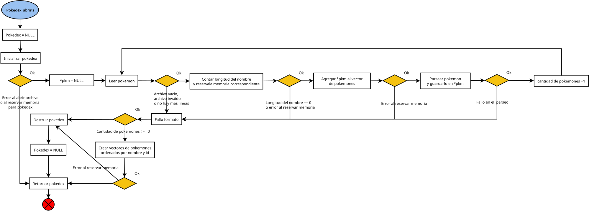
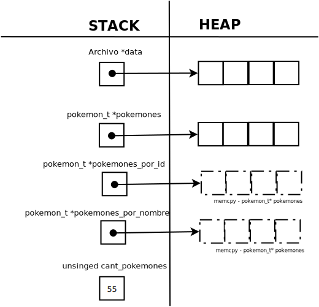
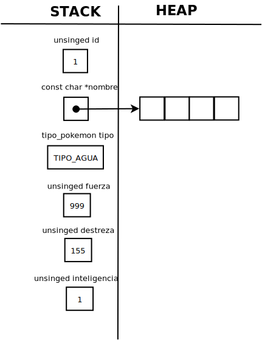
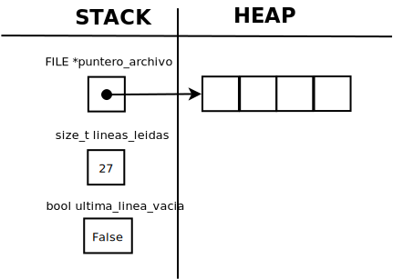

<div align="right">

</div>

# TP1: Archivos, strings y muchos punteros

## Alumno: Diego Jose Fernandez Giraldo - 112571 - diego.j.fernandez.g@gmail.com

- Para compilar:

```bash
$ gcc tp1.c src/*c -o tp1 -std=c99 -Wall -Wconversion -Werror -lm -g
```

- Para ejecutar:

```bash
$ ./tp1 pokedex.csv <argumento_1> <argumento_n>
```

- Para ver una lista de acciones que puedes realizar:

```bash
$ ./tp1 list
```

- Para ejecutar con valgrind:
```bash
$ valgrind ./tp1 pokedex.csv <argumento_1> <argumento_n>
```

---

##  Funcionamiento

```c
const char *archivo_leer_linea(Archivo *archivo);
```

__Lee dinámicamente una línea del archivo hasta encontrar un \n y devuelve un puntero a la línea leída.__

Si el buffer actual no tiene suficiente capacidad, se duplica y se realoca la memoria. La línea devuelta no incluye el carácter de nueva línea (```\n```), sino que lo reemplaza por el terminador nulo (```\0```).

Si la última línea del archivo termina en ```\n```, se activa el campo __archivo->ultima_linea_vacia__ para que la función pueda ser invocada una vez más y devolver una línea vacía (```""```), representando esa última línea.

__archivo_leer_linea() está implementada utilizando fgets().__ En los casos donde se llega al final del archivo sin encontrar un ```\n```, fgets() puede devolver NULL. Sin embargo, si se leyó al menos un carácter antes del NULL, la función manejará ese caso correctamente y devolverá igualmente la línea leída.
En cambio, si no se leyó nada, se alcanzó el final del archivo, o hubo un error de memoria, la función devolverá NULL.


```c
pokedex_t *pokedex_abrir(const char *archivo); // Diagrama de funcionamiento:
```

<div align="center">

</div>

Es la que inicializa la pokedex y rellena sus campos correspondientes al leer y parsear los datos del archivo pasado por parametro ( _con el formato: id;nombre;tipo;fuerza;destreza;inteligencia_ ). Una vez almacenado todos los datos realiza dos copias del contenido del vector dinámico pokemones, generando dos vectores independientes ( __pokemones_por_id_ y pokemones_por_nombre_ ), que luego se ordenan por su respectivo criterio. **En caso de que la inicialización, almacenamiento y ordenamiento se hayan realizado correctamente** ( _correctamente se considera por lo menos el haber leído una linea con el formato dado_ ) **se devolvera la pokedex con todos los datos, de lo contrario se devuelve NULL.**

 ```c
unsigned pokedex_iterar_pokemones(pokedex_t *pokedex, enum modo_iteracion modo,
				  bool (*funcion)(struct pokemon *, void *),
				  void *ctx);
```

Sirve de __iterador interno__ para cuando se deba acceder a los datos almacenados dentro de la struct pokedex_t aplicandole una función de iteración recibida por parametro a cada pokemon y __devolviendo la cantidad de pokemones iterados__.

```c
const struct pokemon *pokedex_buscar_pokemon(pokedex_t *pokedex,
					     enum modo_busqueda modo,
					     void *filtro); 
```

Esta función se encarga del funcionamiento de __pokedex_buscar_pokemon_id()__ y __pokedex_buscar_pokemon_nombre()__. Lo que hace es __iterar al vector dinámico pokemones almacenado en la pokedex y comparar con el filtro recibido por parametro__, este filtro al ser un __void*__ permite flexibilidad de mandarle cualquier tipo de dato, por ende solo tengo que usar un condicional para indicarle a la funcion si quiero buscar por id o por nombre. __Si encontro coincidencias devuelve el puntero pokemon, en caso contrario devuelve siempre NULL.__


```c
void pokedex_destruir(pokedex_t *pokedex);
```

**Se encarga de liberar toda la memoria reservada antes de finalizar el programa y evitar fugas de memoria.** Cabe destacar que antes de liberar la memoria reservada de una pokedex, itera cada pokemon almacenado para liberar primero la memoria reservada que guarda sus nombres. En caso de no hacerlo se pierde acceso al vector dinámico de pokemones y termina con perdidas de memoria el programa.


```c
unsigned pokedex_cantidad_pokemones(pokedex_t *pokedex);
```

Por defecto la función retorna 0 si no existe una pokedex. En caso de existir **devolvera la cantidad de pokemones que almacena la misma** ( _esto puede suceder si se invoca antes __pokedex_abrir()___ ).

---

## Respuestas a las preguntas teóricas

 - Explicar la elección de la estructura para implementar la funcionalidad pedida. Justifique el uso de cada uno de los campos de la estructura.

```c
struct pokedex {
	Archivo *data;
	pokemon_t *pokemones;
	pokemon_t *pokemones_por_id;
	pokemon_t *pokemones_por_nombre;
	unsigned cant_pokemones;
};
```
Elegí al implementar la struct pokedex aprovechar el uso de la struct Archivo del TP0, ya que facilita luego realizar la apertura, lectura y cierre de los archivos que sean ingresados al programa. Es por ello que mi primer campo es __Archivo *data__.

En cuanto a __pokemon_t *pokemones__ la elegí para almacenar en el heap un vector de los pokemones que hayan sido leídos y válidados correctamente. Por lo tanto también tuve que asignarle **unsiged cant_pokemones** para tener un conteo de los pokemones almacenados y no pasarme del rango al querer iterar sobre los mismos.

 __pokemon_t *pokemones_por_id__ y __pokemon_t *pokemones_por_nombre__ son una solución a la problematica de:
 ```c
unsigned pokedex_iterar_pokemones(pokedex_t *pokedex, enum modo_iteracion modo,
				  bool (*funcion)(struct pokemon *, void *),
				  void *ctx);
```
Para cumplir con la restricción de implementar la función __pokedex_iterar_pokemones()__ con complejidad O(n) en tiempo y O(1) en espacio, se preparan en la struct previamente dos vectores ordenados (___pokemones_por_id___ _y_ ___pokemones_por_nombre___). De este modo, al momento de iterar, simplemente se selecciona el vector adecuado según el modo y se aplica la función sin necesidad de ordenar.

Los vectores ordenados (___pokemones_por_id___ _y_ ___pokemones_por_nombre___) son copias del contenido del vector original __pokemones__. Esto permite ordenarlos de distintas maneras sin alterar el orden original.

 - Explicar con diagramas cómo quedan dispuestas las estructuras y elementos en memoria.

### struct pokedex:

<div align="center">

</div>

### struct pokemon:

<div align="center">

</div>

### struct Archivo:

<div align="center">

</div>

 - Justificar la complejidad computacional temporal de **cada una** de las funciones que se piden implementar.

 ```c
unsigned pokedex_cantidad_pokemones(pokedex_t *pokedex); // O(1) en tiempo y O(1) en espacio.
														 	 // demora siempre lo mismo en retornar la cantidad de pokemones => tiempo O(1). 										
															 // no reserva memoria extra de la que ya tiene => espacio O(1).
```

```c
void pokedex_destruir(pokedex_t *pokedex); // O(n) en tiempo y O(1) en espacio.
										   // el tiempo que tarda en liberar el vector dinámico de pokemones
										   // es proporcional a la cantidad de pokemones guardados en la pokedex => tiempo O(n).
										   // no reserva memoria extra de la que ya tiene => espacio O(1).
```

 ```c
unsigned pokedex_iterar_pokemones(pokedex_t *pokedex, enum modo_iteracion modo, // O(n) en tiempo y O(1) en espacio.
				  bool (*funcion)(struct pokemon *, void *),     					// el tiempo que tarda en iterar es proporcional a la cantidad de pokemones guardados en la pokedex => tiempo O(n).
				  void *ctx);													    // no reserva memoria extra de la que ya tiene => espacio O(1).
				  																		
```

```c
const struct pokemon *pokedex_buscar_pokemon_id(pokedex_t *pokedex,		 // Como ambas funcionan con pokedex_buscar_pokemon las analizo por igual: O(n) en tiempo y 0(1) en espacio.
						unsigned id);  									 //	el tiempo que tarda iterando y comparando en encontrar el pokemon buscado es dependiente de la cantidad de pokemones (n) => tiempo O(n)
																		 // no reserva memoria extra de la que ya tiene => espacio O(1).
const struct pokemon *pokedex_buscar_pokemon_nombre(pokedex_t *pokedex,
						    const char *nombre);
```

```c
pokedex_t *pokedex_abrir(const char *archivo); 			// O(m * n + 15m + 1 + 1 + n + n²) => O(n² + m * n + 15m + n + 2) => O(n²) en tiempo (justificación en las lineas de codigo y porque en el peor de los casos n > m) y
{														// O(n) en espacio ya que la reserva de memoria extra es proporcional a la cantidad de pokemones.
	pokedex_t *pokedex = NULL; // O(1)					
	if (!inicializar_pokedex(&pokedex, archivo)) { 
		return NULL; // O(1)
	}

	const char *nombre_pkm = NULL; // O(1)
	pokemon_t *pkm = NULL; // O(1)
	char tipo_pkm = '\0'; // O(1)
	bool fallo_formato = false; // O(1)
	while (archivo_hay_mas_lineas(pokedex->data) && !fallo_formato) { // O(m) => total: O(m * (n + 1 + 2 + 2 + 2 + 3 + 2 + 1 + 2) = O(m * n + 15m)
		const char *linea = archivo_leer_linea(pokedex->data); // archivo_leer_linea() es O(n²) pero al duplicar el buffer con el que se reasigna memoria, se logra amortizar transformando su complejidad en O(n)
		size_t long_nombre = contar_longitud_nombre_pkm( 
			linea, (unsigned)strlen(linea)); // O(1)
		if (long_nombre == 0) { // O(1) => total: O(1 + 1) = O(2)
			fallo_formato = true; // O(1)
		}

		if (!reallocar_nombre_pkm(&nombre_pkm, long_nombre + 1) && // O(1) => total: O(1 + 1) = O(2)
		    !fallo_formato) {
			fallo_formato = true; // O(1)
		}

		if (!agregar_pokemon(pokedex, &pkm) && !fallo_formato) { // O(n) => total: O(1 + 1) = O(2)
			fallo_formato = true; // O(1)
		}

		if (sscanf(linea, "%u;%[^;];%c;%u;%u;%u", &pkm->id, // total: O(2 + 1) => O(3)
			   (char *)nombre_pkm, &tipo_pkm, &pkm->fuerza,
			   &pkm->destreza,
			   &pkm->inteligencia) == TOTAL_DATOS_PKM &&
		    !fallo_formato) { // O(n)
			if (!asignar_tipo_pkm(&pkm->tipo, tipo_pkm) ||  
			    !asignar_nombre_pkm(nombre_pkm, &pkm->nombre)) { // O(1) => total: O(1 + 1) = O(2)
				fallo_formato = true; // O(1)
			}
		} else {
			fallo_formato = true; // O(1)
		}

		if (!fallo_formato) { // O(1) => total: O(1 + 1) = O(2)
			pokedex->cant_pokemones++; // O(1)
		}
	}

	free((char *)nombre_pkm); // O(1)

	if ((pokedex->cant_pokemones) == NO_HAY_PKM) { // O(1) => total: O(1 + n)
		return destruir_pokedex_invalida(pokedex); // O(n)
	}

	if (!crear_vectores_ordenados(pokedex)) { // O(n²) => total: O(n² + n)
		return destruir_pokedex_invalida(pokedex); // O(n)
	}

	return pokedex;
}
```