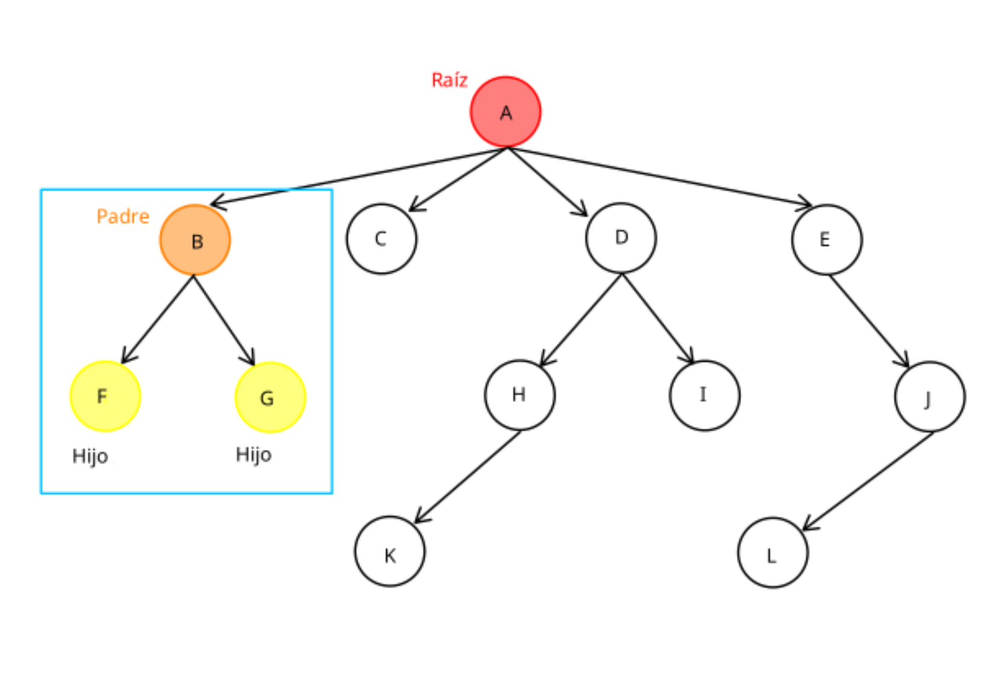

<div align="right">

</div>


# TDA ABB

## Alumno: Diego Jose Fernandez Giraldo - 112571 - diego.j.fernandez.g@gmail.com

- Para compilar:

```bash
make all
```

- Para ejecutar los tests __sin__ valgrind:

```bash
make run
```

- Para ejecutar los tests __con__ valgrind:

```bash
make valgrind
```

---

##  Preguntas del TP

###  Explique teóricamente (y utilizando gráficos) qué es una árbol, árbol binario y árbol binario de búsqueda. Explique cómo funcionan y de ejemplos de utilización de cada uno.

- __Árbol__

Un árbol se puede definir como una colección de nodos, donde existe un nodo principal llamado raíz que no tiene padre. A partir de este nodo se ramifican otros nodos llamados hijos, formando subárboles que siguen la misma estructura. Cada nodo puede tener uno o más hijos, y un único padre (excepto la raíz). Cuando un nodo no tiene hijos, se lo denomina hoja. 

<div align="center">

</div>

Un ejemplo del uso de árboles son los sistemas de archivos de la computadora donde hay una directorio raíz (_raíz del árbol_) del cuál se ramifican otros subdirectorios (_subárboles_) o archivos (_hojas de los árboles_).

<div align="center">

</div>

- __Árbol binario__

Un árbol binario tiene de caracteristica principal que una raíz solo pueda tener un máximo de dos hijos a los cuales se le da de nombre _subárbol izquierdo_ y _subárbol derecho_. Esto nos es de utilidad para otras definiciones de árboles binarios donde se introducen comparadores u otras caracteristicas que benefician ciertas operaciones, como la de búsqueda.

<div align="center">

</div>

- __Árbol binario de búsqueda__

Un árbol binario de búsqueda contiene una función comparadora que nos permite distinguir y ordenar los elementos insertados en el árbol a la hora de que si nos movemos a un subárbol izquierdo se encuentren por ejemplo elementos menores al elemento de la raíz y si nos movemos al subárbol derecho encontraremos elementos mayores al elemento de la raíz, esta regla se aplica también a cada subárbol de manera independiente (_esto es una convención, por lo tanto los arboles menores pueden estar del lado derecho y mayores del izquierdo o que no este permitido almacenar elementos iguales, etc_). 

Un ejemplo de uso es en las bases de datos para un acceso eficiente de los mismos.

<div align="center">

</div>

#### Recorrido

Las formas de recorrido de un árbol se definen en función del orden en que se visita un nodo respecto a sus subárboles, estas formas se definen entre las distintas combinaciones del orden de acciones (visitar el nodo actual (N), visitar el subárbol izquierdo (I) o visitar el subárbol derecho (D)) las combinaciones que usamos son:

Preorden: Se visita primero el nodo actual, luego el subárbol izquierdo y por último el subárbol derecho. _Este recorrido es útil para clonar la forma del árbol._

Inorden: Se visita primero el subárbol izquierdo, luego el nodo actual y finalmente el subárbol derecho. _Este recorrido para obtener los elementos de forma ordenada si el árbol es un ABB._

Postorden: Se visita primero el subárbol izquierdo, luego el subárbol derecho y finalmente el nodo actual. _Este recorrido se suele usar para liberar memoria, ya que visita las hojas antes que sus padres._

#### Equilibrio

Al insertar muchos elementos en un árbol binario de búsqueda puede suceder que se degenere a una lista al no tener un control en la distribución de elementos aumentando en consecuencia la complejidad de las operaciones de búsqueda, inserción u eliminación.

Esto se evita cuando el árbol se encuentra equilibrado, es decir, que la dierencia de alturas entre cualquier subárbol izquierdo y derecho se encuentre entre los valores -1 <= x <= 1. Esto logra que cualquier operación de las antes mencionadas tarden en caso promedio log(n).

###  Explique la implementación de ABB realizada y las decisiones de diseño tomadas (por ejemplo, si tal o cuál funciones fue planteada de forma recursiva, iterativa o mixta y por qué, que dificultades encontró al manejar los nodos y punteros, reservar y liberar memoria, etc).

Para este TP hice uso de una estructura de abb predefinida en "abb_estructura_privada.h" y otra estructura auxiliar vectorizar_ctx_t. 

<div align="center">

</div>

Esta implementación del abb hace uso de una subestructura ```nodo_t``` el cual hace función de raíz que puede tener un maximo de dos hijos (_nodo_t *izq y nodo_t *der_) y al enlazar multiples nodos se logra la definición de árbol binario, además al tener un atributo ```int comparador``` permite insertar ordenadamente mediante alguna convención las claves/elementos almacenados en los nodos permitiendo operaciones de búsqueda más eficientes en el mejor de los casos (O(log n)). Por último la estructura del abb tiene un atributo ```int nodos``` que lleva el conteo de la cantidad de nodos almacenados en el abb.

<div align="center">

</div>

Creé esta estructura ```vectorizar_ctx_t``` principalmente por la comodidad que me daría después la implementación de ```abb_vectorizar```. Ya que está estructura me permite almacenar y manejar la información principal que necesito para vectorizar el abb (_capacidad del vector, cantidad de elementos guardados, y el vector donde se guardaran los elementos_). Y también me permitiría usarla de contexto para la función ```abb_recorrer``` y reutilizarla modularizando ```abb_vectorizar```, esto es porque vectorizar el abb es ir recorriendo el abb nodo por nodo en el recorrido determinado e ir aplicandoles una funcion 'f' (_en este caso sería ir guardando el abb en un vector_) y utilizar el ctx de memoria común (_en este caso una variable de tipo vectorizar_ctx_t_).

Las funciones del abb.h de busqueda, inserción, recorrido, vectorizar y destrucción las implementé recursivas, adaptando las implementaciones hechas en clases ya que me pareció lo más cómodo. ```abb_sacar``` la implementé mixta (_la busqueda del nodo a sacar de manera recursiva y el caso en el que el nodo a sacar haya que reemplazarlo por el predecesor inorden, el predecesor se encuentra de manera iterativa con un while_).

A la hora de implementar las funciones del abb.h tuve las siguientes dificultades:

- ```abb_recorrer```: Tuve problemas a la hora de devolver la cantidad correcta de elementos a los cuales le aplico la función 'f' porque en mis primeras implementaciones cuando 'f' devolvía false no avisaba de ninguna forma que las demás llamadas de recorrido dejaran de contabilizar y aplicar 'f'. Lo termine solucionando con un booleano extra que se encargue de detener el recorrido cuando 'f' devuelve false.

- ```abb_sacar```: Tuve problemas al eliminar elementos "NULL" porque la función recursiva que usaba para eliminar un nodo devolvía era el elemento lo que ocasionaba que no pudiera diferenciar si el NULL que devolvia la función era porque el elemento era "NULL" o porque fallo la eliminación del nodo. Lo solucioné modificando lo que debía devolver la función recursiva, en vez de devolver el elemento, devolver el abb actualizado y guardar el elemento a través de un puntero auxiliar. De esta manera si puedo diferenciar si devolví "NULL" porque fallo la función o si devolví "NULL" porque el elemento sacado era "NULL". 

###  Explique la complejidad de las operaciones implementadas para el TDA.

Las funciones ```abb_insertar```, ```abb_buscar```, ```abb_sacar``` en el peor de los casos siempre seran O(n) porque la implementación de este abb no es autobalanceado por lo tanto no se puede controlar que el abb se degenere en una lista haciendo que estas funciones no logren su objetivo de mejorar la complejidad a O(log n) ya que no pueden ir descartando ramas y estar obligado a recorrer todo el abb para realizar una de estas operaciones.

---

#### complejidad de abb autobalanceado

<div align="center">

</div>

#### complejidad de abb degenerado en lista

<div align="center">

</div>

---

- ```abb_crear```: complejidad O(1), solo se inicializa en un estado valido la estructura del abb.

- ```abb_insertar```: complejidad O(n) en el peor de los casos por no ser un abb autobalanceado. En caso promedio donde el abb se encuentre balanceado la complejidad es log(n).

- ```abb_existe```: complejidad O(n) en el peor de los casos por no ser un abb autobalanceado. En caso promedio donde el abb se encuentre balanceado la complejidad es log(n).

- ```abb_buscar```: complejidad O(n) en el peor de los casos por no ser un abb autobalanceado. En caso promedio donde el abb se encuentre balanceado la complejidad es log(n).

- ```abb_sacar```: complejidad O(n) en el peor de los casos por no ser un abb autobalanceado. En caso promedio donde el abb se encuentre balanceado la complejidad es log(n).

- ```abb_tamanio```: complejidad O(1), inmediato acceso a traves del atributo ```size_t nodos``` de la estructura.

- ```abb_vacio```: complejidad O(1), inmediato acceso a traves del atributo ```size_t nodos``` de la estructura.

- ```abb_recorrer```: complejidad O(n), en el peor de los casos se aplica la función a todos los nodos del abb, por lo tanto se recorrio todo el abb.

- ```abb_vectorizar```: complejidad O(n), en el peor de los casos se pasa un vector con la capacidad igual al tamaño del abb, por lo tanto se termina recorriendo todo el abb.

- ```abb_destruir```: complejidad O(n), hay que recorrer todo el abb para eliminarlo correctamente.

- ```abb_destruir_todo```: complejidad O(n), hay que recorrer todo el abb para eliminarlo correctamente.


