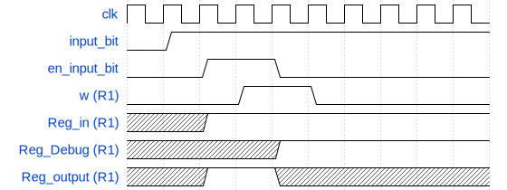
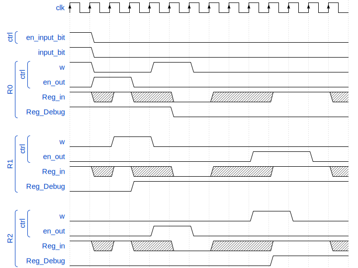

# Secuenciales

Analizar el componente ```regZ``` y responder:

1. ¿Cuáles son y qué representa cada entrada y cada salida del componente? ¿Cuáles entradas deben ser consideradas como de control?

    Entradas: 
    - ```clk```: Representa el intervalo de tiempo en el que el estado siguiente pasa a ser el estado actual.
    - ```Reg_in```: Representa a la entrada de valores (_1-bit_) que pueden ser guardados en el registro.
    - ```w``` (_componente de control_): Representa un componente de control que habilita cuando escribir un valor en el registro.
    - ```en_out``` (_componente de control_): Representa un componente de control que habilita cuando leer el valor almacenado en el registro.

    Salidas: 
    - ```Reg_output```: Representa a la salida del valor almacenado en el registro y ser utilizado por otro sistema del circuito.
    - ```Reg_Debug```: Representa a la salida del valor almacenado en el registro y mantener un seguimiento a su funcionamiento correcto.


2. Las entradas input_bit y en_input_bit sirven para poder introducir en el circuito un valor arbitrario. Escribir una secuencia de activación y desactivación de entradas para que el registro R1 pase a tener el valor 1.

<div align="center">

</div>

3. Dar una secuencia de activaciones que inicialmente ponga un valor 1 en R0, luego que este valor se transfiera a R1, luego que el valor de R2 pase a R0 y finalmente el valor de R1 a R2.

<div align="center">

</div>

# OrgaSmall

## 1. Análisis

- Recorrer la máquina y la hoja de datos, estudiar el funcionamiento de los circuitos indicados y responder las siguientes preguntas:

    - ¿Cuál es el tamaño de la memoria?

        Esta memoria contiene 256 posiciones de palabras de 32 bits y para poder direccionarlas son necesarios 9 bits, esto se puede verificar con el bus de memoria que va de 0 a 8.

    - ¿Qué tamaño tiene el ```PC```?

        El tamaño del ```PC``` es de 8 bits se puede observar en las entradas y salidas ya que tienen un ancho de 8 bits.

    - Observando el formato de instrucción y los CodOp de la hoja de datos: ¿Cuántas instrucciones nuevas se podrían agregar respetando el formato de instrucción indicado?

        ```CodOp``` es de 5 bits esto permite un total de 2⁵ = 32 combinaciones posibles de códigos de operación. Actualmente hay 22 instrucciones definidas, por lo que se podria agregar 10 instrucciones.

- Mirando los módulos indicados de hardware:

    - ```PC``` (Contador de Programa): ¿Qué función cumple la señal ```inc```?
        
        ```PC``` lleva el conteo de que dirección de la memoria leer para extraer la instrucción y esta al ser de 16 bits y un bus de 8 bits es necesario ```inc``` para poder extraer en su totalidad la instrucción más las siguientes que ejecutará o no el micro.

    - ```ALU``` (Unidad Aritmético Lógica): ¿Qué función cumple la señal ```opW```?

        Al realizar una operación en la ```ALU``` se calculan las flags y ```opW``` al estar activado, es la responsable de que se escriban esas flags en su registro correspondiente para su posterior uso.

    - ```microOrgaSmall``` (```DataPath```): ¿Para qué sirve la señal ```DE_enOutImm```? ¿Qué parte del circuito indica que registro se va a leer y escribir?

        ```DE_enOutImm``` escribe en el bus el valor inmediato de la unidad de decode que vino codificada en la instrucción previamente leída (_valueM_) sirve por ejemplo para la instrucción ```JMP``` donde tienes que escribir en ```PC_load``` a que posición de la memoria vas a saltar para leer la siguiente instrucción.

        Para habilitar la escritura se tiene que encender ```RB_enIn``` y para la lectura ```RB_enOut```  y con ```RB_select_IndexIn``` y ```RB_select_IndexOut``` eliges cual registro escribir o leer respectivamente.
 
    - ```ControlUnit``` (Unidad de control): ¿Cómo se resuelven los saltos condicionales? Describir el mecanismo.

        Los saltos condicionales se resuelven verificando las señales ```jc/jz/jn_microOp``` contra el valor del registro de flags. Un multiplexor toma esta señal y selecciona la nueva dirección para microPC entre:

        - ```microPC + 1``` (continuar a la siguiente microinstrucción)

        - ```{OP_code, 0000}``` (nuevo bloque de microinstrucciones), se usa si se debe realizar un salto condicional

        

## 2. Ensamblar y correr

```asm
JMP seguir

seguir:
SET R0, 0xFF
SET R1, 0x11

siguiente:
ADD R0, R1
JC siguiente

halt:
JMP halt
```

- Antes de correr el programa, identificar el comportamiento esperado.

    El código empieza inicializando dos registros R0 (0xFF = 255) y R1 (0x11 = 17). Luego entra en un bucle donde los suma hasta que la suma no genere acarreo. En caso de haber acarrero se vuelva a ejecutar la suma y R0 va almacenando el resultado. Cuando no hay mas acarreo entra en un bucle infinito, deteniéndose la ejecución.

- ¿Qué lugar ocupará cada instrucción en la memoria? Detallar por qué valor se reemplazarán las etiquetas.
    
    ```asm
    JMP seguir    ; |00|
    seguir:       ; |02|
    SET R0, 0xFF  ; |02|
    SET R1, 0x11  ; |04|
    siguiente:    ; |06|
    ADD R0, R1    ; |06|
    JC siguiente  ; |08|
    halt:         ; |0c|
    JMP halt      ; |0c|

    ; seguir = 00000010 (02)
    ; siguiente = 00000110 (06)
    ; halt = 00001100 (0c)
    ```

- Ejecutar y controlar ¿cuántos ciclos de clock son necesarios para que este código llegue a la instrucción ```JMP halt```?

    __53 clocks__ tarda ese código en llegar a la instrucción ```JMP halt```

- ¿Cuántas microinstrucciones son necesarias para realizar el ADD? ¿Cuántas para el salto?

    - __JMP__ necesita de __2__ microinstrucciones.

    - __ADD__ necesita de __5__ microinstrucciones.

