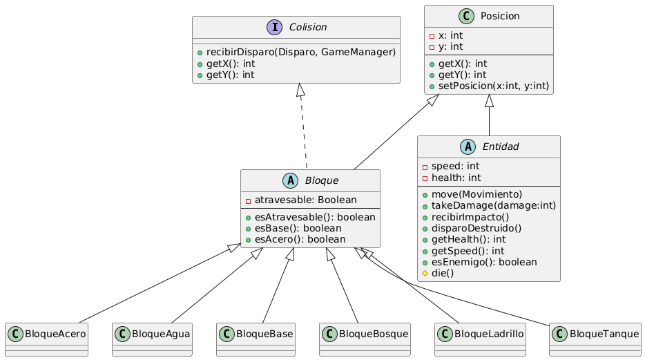
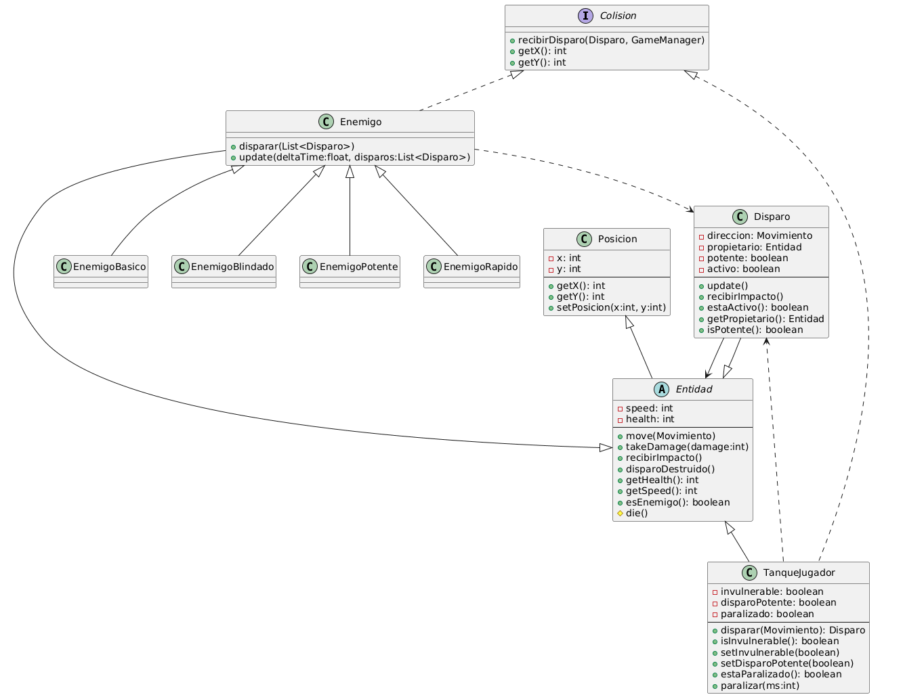
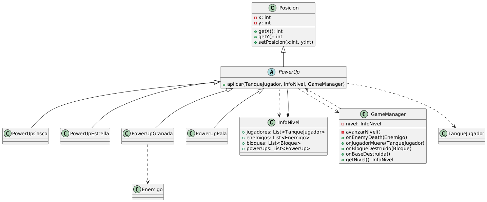
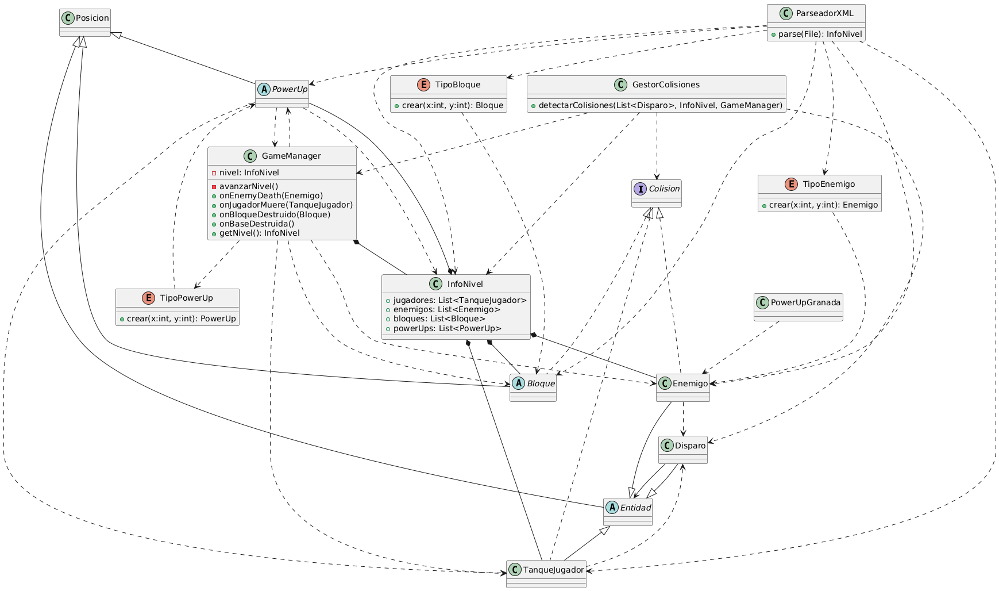

# YABC – Battle City Encapsulados
|                   Universidad                        |            Materia              |                Docentes                  | Correctora             |                            Encapsulados                                |
|:----------------------------------------------------:|:-------------------------------:|------------------------------------------|------------------------|------------------------------------------------------------------------|
| Facultad de ingeniería, universidad de Buenos Aires | Paradigmas de la programación | - Essaya Diego <br> - Maraggi Santiago      | - Macarena Vita Sanche | - Fernández Giraldo Diego Jose (112571) <br> - Galeano Galvis Sara Lucia (112120) |

## Link videos
Sara : https://youtu.be/8MuVhd2gCX0
Diego : https://youtu.be/F05PyV25Obw

## Descripción breve
Implementación en Java del clásico "Battle City" para el curso de Paradigmas de Programación (FIUBA). El proyecto pone foco en diseño orientado a objetos con bajo acoplamiento y alta cohesión, incorporando tanques controlados por jugadores, enemigos con distintos comportamientos, power-ups y efectos audiovisuales soportados por JavaFX.

## Diseño y principios aplicados
- **Polimorfismo en la lógica de juego**: la jerarquía `Entidad` → `TanqueJugador`/`Enemigo`/`Disparo` permite que cada actor redefina su comportamiento (`die`, `recibirDisparo`, velocidad, vidas) sin condicionales. Los enemigos concretos (`EnemigoBasico`, `EnemigoRapido`, `EnemigoBlindado`, `EnemigoPotente`) extienden a `Enemigo` configurando estadísticas y otorgando recompensas distintas al morir.
- **Power-ups extensibles**: `PowerUp` define la operación `aplicar(...)` y cada subclase implementa efectos específicos (granada, casco, pala, estrella) que modifican el estado del jugador o del nivel sin tocar el código cliente, cumpliendo OCP.
- **Delegación para animaciones**: la vista usa `LogicaAnimaciones` y `SpriteManager`, que resuelven los ciclos de frames mediante estrategias por tipo de entidad. Esto evita `instanceof`, facilita agregar sprites nuevos y mantiene cohesión dentro de la capa de presentación.
- **Separación de responsabilidades**: el paquete `fiuba.encapsulados.modelo` concentra reglas de juego, detección de colisiones y sistema de nivel; el paquete `fiuba.encapsulados.vista` se encarga de JavaFX (render, input, audio, menú), comunicándose con el modelo únicamente a través de sus objetos.
- **Principios de simplicidad y DRY**: las constantes de controles (`ControlesJugador`) y sprites (`SpriteManager`) centralizan configuraciones; el `GameManager` coordina spawns y condiciones de victoria/derrota para evitar lógica duplicada en la vista.

## Requisitos
- JDK 21
- Maven 3.9+
- JavaFX (gestionado automáticamente por el plugin `javafx-maven-plugin`)

## Ejecución
1. Ubicarse en el directorio del módulo JavaFX:
   ```bash
   cd YABC
   ```
2. Compilar y lanzar el juego:
   ```bash
   mvn clean javafx:run
   ```

Al iniciar, se muestra el menú principal con opciones para comenzar una partida de uno o dos jugadores.

## Instrucciones de juego
- **Objetivo**: proteger la base aliada mientras destruyes los tanques enemigos.
- **Jugabilidad**:
  - Selecciona la cantidad de jugadores en el menú.
  - El juego finaliza si todos los jugadores pierden sus vidas o si los enemigos destruyen la base.
- **Controles**:


  | Acción          | Jugador 1 | Jugador 2           |
  |-----------------|-----------|---------------------|
  | Mover arriba    | `W`       | `↑` (flecha arriba) |
  | Mover abajo     | `S`       | `↓`                 |
  | Mover izquierda | `A`       | `←`                 |
  | Mover derecha   | `D`       | `→`                 |
  | Disparar        | `Espacio` | `Enter`             |

- **Power-ups**: al recogerlos se activan efectos temporales como invulnerabilidad, disparos más potentes o congelamiento de enemigos.

## Diagrama UML del modelo





[](https://classroom.github.com/a/Sn8wv7lZ)
